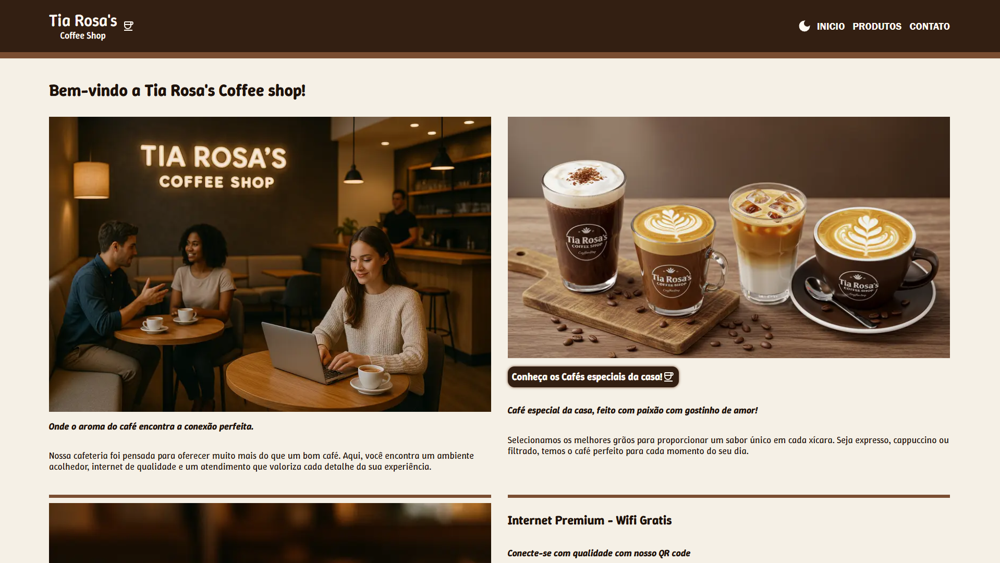

# Tia Rosa's Coffee Shop ☕ – Academic Project (IESB) (EN-US)

This repository contains the development of a fictional website for **Tia Rosa's Coffee Shop**, created as part of an academic project at **IESB**.

## Implementation

You can view the live version of the website by clicking the image below:

---

## Project Objective

The objective of this project is to build a modern and responsive website using **Next.js**, following the requirements of the course. The website's focus is to:

- Promote the **Tia Rosa’s Coffee Shop**
- Showcase its products
- Highlight the role of employees in the customer experience

---

## Project Structure

The site includes the following main pages:

- **Home**: Introduction to the coffee shop
- **Products**: Detailed description of offered items, such as specialty coffees
- **Contact**: Contact information and the store's location

This project demonstrates skills in front-end development, componentization, and best practices in using **React** and **Next.js**.

---

## Technologies, Tools, and Credits

- **Next.js**
- **Next.js "Image" and "Link"**
- **Next.js App Router**
- **Material UI**
- Hosting via [Vercel](https://vercel.com/)

- Custom images generated with **ImageFX** and **ChatGPT**
- Texts written with the help of **ChatGPT**

---

## SEO (Search Engine Optimization)

Using **Next.js** brought significant benefits in terms of SEO, making the site easier to find by search engines like Google. Some of the optimizations implemented include:

- **Use of Next.js metadata system** (`export const metadata`) to define title, description, and social sharing image for each individual page
- **Creation of a sitemap.xml file** to map and inform search engines of all the site's pages
- **robots.txt file** configured to allow site crawling
- **Semantic structure with accessible HTML5**, using tags such as `<header>`, `<main>`, `<footer>`
- **Responsiveness and fast loading**, favoring ranking on mobile devices

These improvements make the site more SEO-friendly and ready to appear on search engines and social media, ensuring a better experience for users.

---

> **This project is fictional and for educational purposes only.**

---

# Tia Rosa's Coffee Shop ☕ – Projeto Acadêmico (IESB) (PT-BR)

Este repositório contém o desenvolvimento de um site fictício para a **Tia Rosa's Coffee Shop**, criado como parte de um projeto acadêmico da faculdade **IESB**.

## Implementação

Você pode visualizar a implementação do site clicando na imagem abaixo:

---

## Objetivo do Projeto

O objetivo deste projeto é construir um site moderno e responsivo utilizando **Next.js**, conforme os requisitos da disciplina. O foco do site é:

- Promover a cafeteria **Tia Rosa’s Coffee Shop**
- Apresentar seus produtos
- Valorizar o papel dos colaboradores na experiência do cliente

---

## Estrutura do Projeto

O site inclui as seguintes páginas principais:

- **Início**: Apresentação da cafeteria
- **Produtos**: Descrição detalhada dos itens oferecidos, como cafés especiais
- **Contato**: Informações de contato sobre a empresa e localização da loja

Este projeto demonstra habilidades em desenvolvimento front-end, componentização e boas práticas no uso do **React** e **Next.js**.

---

## Tecnologias, Ferramentas e Créditos

- **Next.js**
- **Next.js "Image" e "Link"**
- **Next.js App Router**
- **Material UI**
- Hospedagem via [Vercel](https://vercel.com/)

- Imagens personalizadas geradas com **ImageFX** e **ChatGPT**
- Textos elaborados com o auxílio do **ChatGPT**

---

## SEO (Search Engine Optimization)

O uso do **Next.js** trouxe grandes benefícios em termos de SEO, tornando o site mais fácil de ser encontrado por motores de busca como o Google. Algumas das otimizações implementadas incluem:

- **Uso do sistema de metadata do Next.js** (export const metadata) para definir título, descrição e imagem de compartilhamento social para cada página individual
- **Criação de um arquivo sitemap.xml** para mapear e informar aos motores de busca todas as páginas do site
- **Arquivo robots.txt** configurado para permitir o rastreamento do site
- **Estrutura semântica com HTML5 acessível**, usando tags como `<header>`, `<main>`, `<footer>`
- **Responsividade e carregamento rápido**, favorecendo o ranqueamento em dispositivos móveis

Essas melhorias tornam o site mais preparado para aparecer em mecanismos de busca e redes sociais, além de garantir uma melhor experiência para os usuários.

---

> **Este projeto é fictício e tem fins exclusivamente educacionais.**
